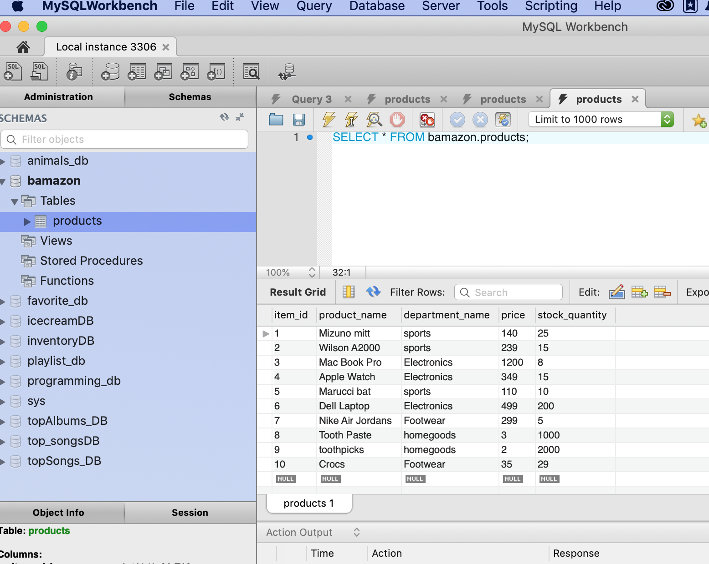
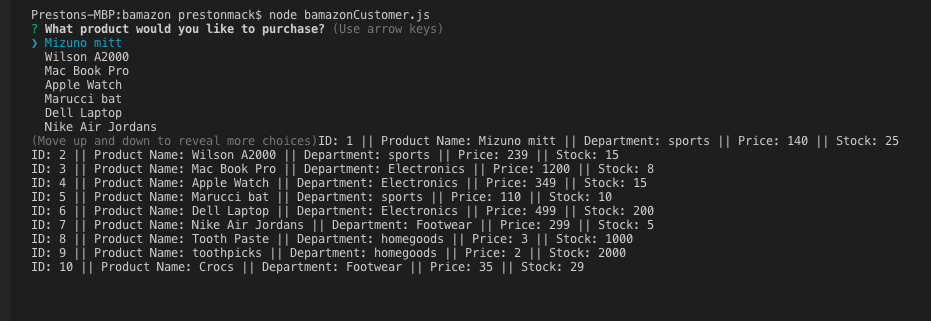
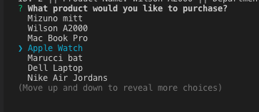
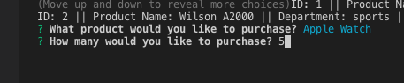
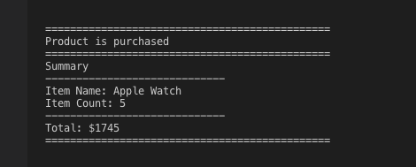
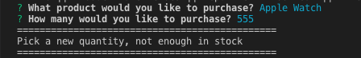

# bamazon

Bamazon is a Command Line interface. 
We have to write a JS app to display and access the data we created in the MySQL database named "bamazon"

First we execute the "node bamazonCustomer" in the Terminal.
We get a list of the available items for sale. 

We prompt the user "What product would you like to purchase?"
We use the up/down arrow to select an item from the choices array.

Then we pick the quantity.

The app will then compute the sale assuming that there is enough inventory to complete the sale. 

If there is not enough inventory, the app will tell you. 

After this transaction, the data in the bamazon database is updated to reflect the purchase. 

